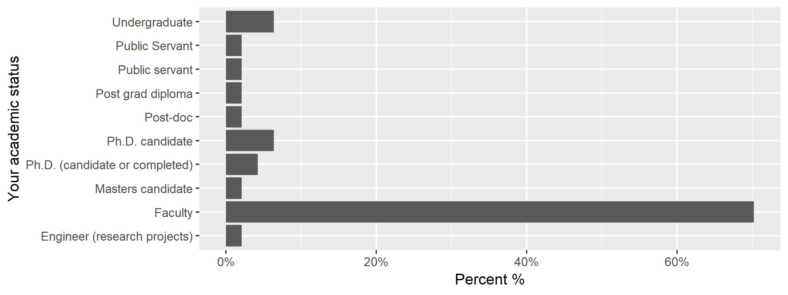
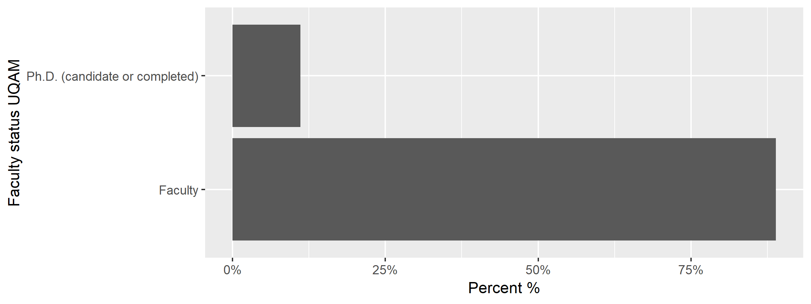
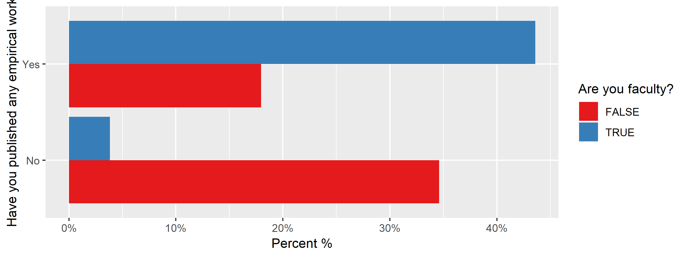
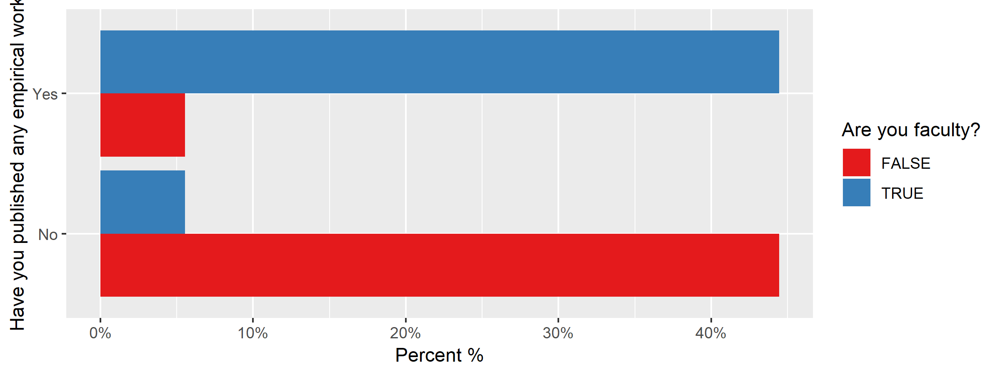
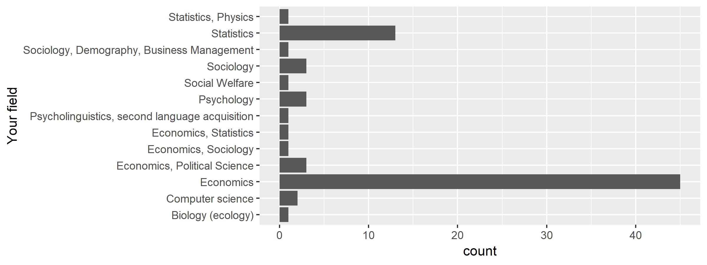
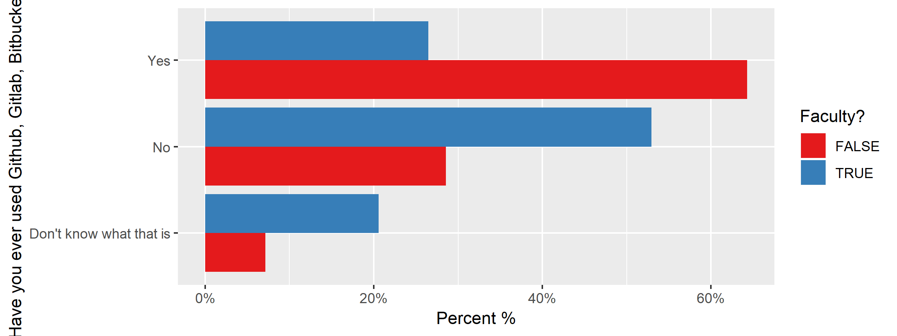

Programs: Replication and Reproducibility in Social Sciences and Statistics: Context, Concerns, and Concrete Measures
========================================================
author: Lars Vilhuber
date: 2019-06-29
autosize: true
width: 1920
height: 900


Download the survey data from Google Sheet
===================================
The responses to the surveys are stored on Google Sheets. The following program is NOT automatically run when executing this README - change the `eval=FALSE` to `eval=TRUE` to run it, or run it manually.


```r
source(file.path(programs,"01_download_surveys.R"),echo=TRUE)
source(file.path(programs,"02_combine_surveys.R"),echo=TRUE)
```


Results
=======
We can now show the results. 

- Latest location: UQAM
- 77 responses (of which 18 from UQAM)
- Latest responses: 4/8/2019 11:40:08

Faculty status
=================



Faculty status (UQAM)
=================




Have You Published?
============


Have You Published (UQAM)?
============




Fields
======



Knowledge of Github, by faculty status
===============




```
Error in eval(parse_only(code), envir = envir) : 
  object 'lastest.location' not found
```
